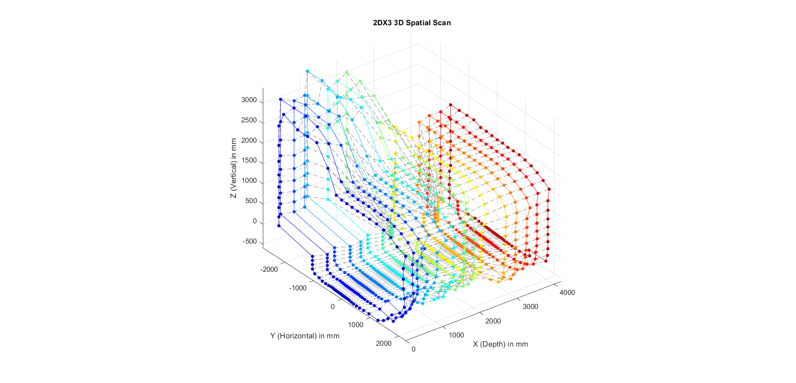

# 3D Spatial Mapping System
An automated, high-precision spatial mapping system designed to generate 3D environmental data using Time-of-Flight (ToF) technology.

## **Project Overview**
This project involves the design and implementation of a LiDAR-style 3D spatial scanner. It utilizes an **ARM Cortex-M4F** microcontroller to synchronize a **VL53L1X Time-of-Flight sensor** with a stepper motor drive system. The system performs automated $360^\circ$ scans, capturing distance data that is then processed and visualized as a 3D point cloud in **MATLAB**.

---

## **Technical Stack**
* **Microcontroller:** ARM Cortex-M4F (MSP432P401R)
* **Sensing:** VL53L1X Long-Range Time-of-Flight Sensor
* **Communication Protocols:** I2C (Sensor Data), UART (Data Logging to PC)
* **Actuation:** 28BYJ-48 Stepper Motor with ULN2003 Driver
* **Software & Analysis:** Embedded C, MATLAB

---

## **Key Features**
* **Automated Scanning:** Implemented firmware to handle precise stepper motor steps, ensuring the sensor is stable before each measurement is taken.
* **High-Precision Sensing:** Leveraged the VL53L1X sensor to achieve millimeter-accurate distance readings via the I2C protocol.
* **Coordinate Transformation:** Developed a MATLAB processing pipeline to convert raw polar coordinates (Distance, Angle) into a 3D Cartesian $(x, y, z)$ point cloud.
* **Optimized Firmware:** Utilized interrupt-driven logic and low-level peripheral configuration to manage real-time hardware synchronization.

---

## **System Architecture**
1.  **Hardware Control:** The ARM Cortex-M4F triggers the stepper motor to rotate in fixed angular increments.
2.  **Data Acquisition:** At each step, the VL53L1X sensor measures the distance to the nearest object.
3.  **Data Transmission:** Distance and angular data are packaged and transmitted to a PC via a Bus Pirate or UART-to-USB bridge.
4.  **Visualization:** MATLAB parses the data stream and renders a 3D mesh representing the scanned environment.

---

## **Repository Structure**
* `Spatial_Scanner_Main.c`: Core embedded C firmware for the ARM Cortex-M4F.
* `Scanner_Visualization.m`: MATLAB script for data parsing and 3D plot generation.
* `Sample_Scan_Data.mat`: A sample dataset from a successful scan.
* `Result.png`: A visualization of the generated 3D point cloud.

---
*Developed as part of a 2nd-year Electrical Engineering technical project, focusing on embedded systems and sensor integration.*
